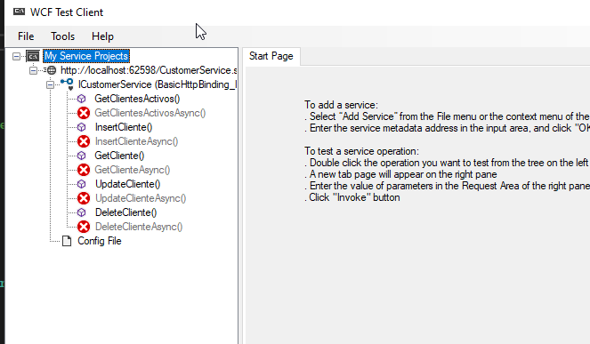
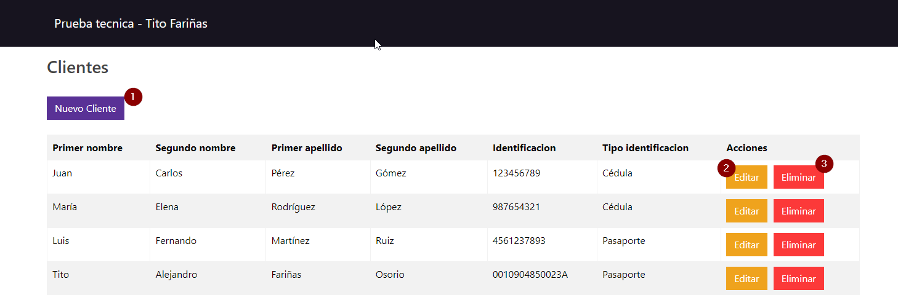
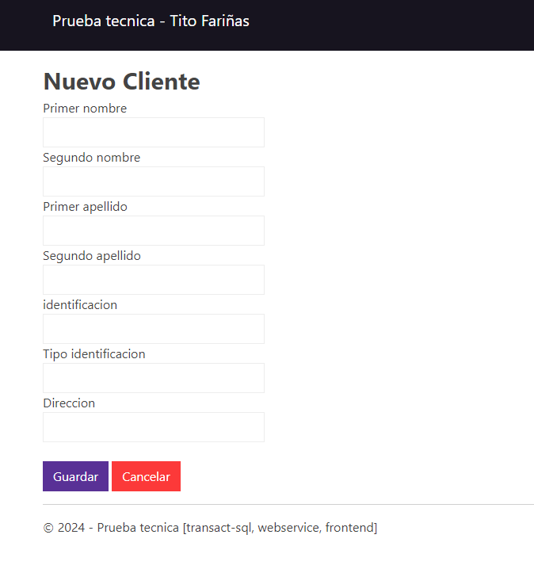
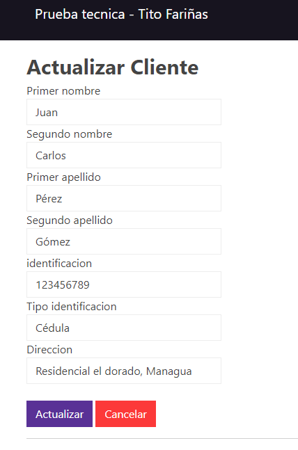

# PRUEBA TECNICA - ANALISTA DE SISTEMAS

## Objetivo

Determinar el nivel de conocimiento básico sobre transact-sql, webservices y frontend

## Actividades

### Entregable 1 - Base de datos

- ✅ Crear una Base de Datos de Nombre “Test”
- ✅ Crear las siguientes tablas
  - Cliente
  - Direccion
  - Prestamo
- ✅ Crear indices para las tablas en base a su id
- ✅ Crear procedimientos almacenados que realice CRUD para las tablas cliente, direccion, prestamo
- **Elaborar consultas que genere**
  - ✅ Listado de clientes con sus direciones y prestamos asociados, cuyos prestamos esten activos y el plazo financiamiento sea mayor a 36 meses
  - ✅ Cantidad de prestamos por estado y moneda con monto mayor a 10k usd

### Entregable 2 - Web Service (BackEnd)

- ✅ Crear proyecto WCF en visualstudio 2022
- ✅ Desarrolle tres métodos de entrada para dar de Alta y modificar datos de Clientes haciendo uso del Procedimiento Almacenado elaborado en el _Entregable 1_ de esta prueba. Preferiblemente estructurar su proyecto con al menos el uso de tres capas.

### Entregable 3 - FrontEnd

- ✅ En Visual Studio, cree un proyecto de tipo ASP.NET (Framework) de nombre “Test”
- ✅ Desarrolle frontend funcional para captura y modificación de datos de Clientes haciendo uso del WCF elaborado en el _entregable 2_

MOP

- Ejecutar archivo **create_db_tables.sql** que se encuentra en carpeta Entregable1
- Ejecutar archivo **create_sp.sql que se** encuentra en carpeta Entregable1

- Abri solucion de WCF con visual studio 2022
- correr el programa

- Abrir solucion de FrontEnd con visual studio 2022
- Ejecutar la solucion

### Pantalla listado de clientes

1. Nuevo cliente
2. Editar cliente
3. Eliminar cliente

### Pantalla nuevo cliente

### Pantalla Editar cliente

